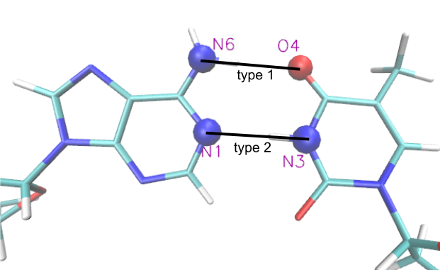
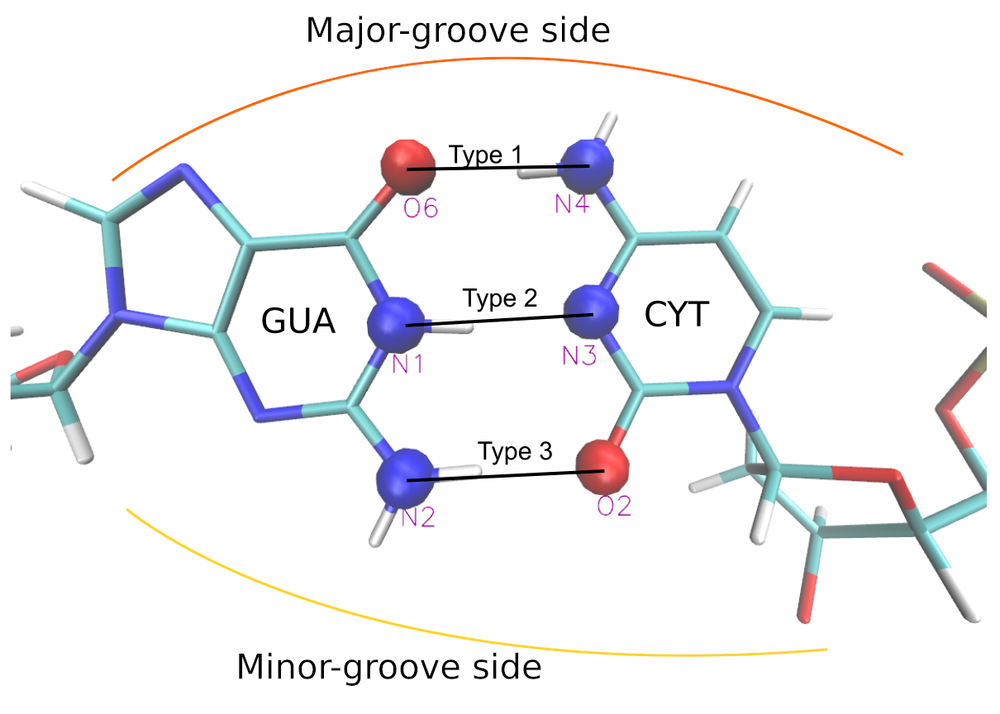

# enmspring

# Create a virtual environment
`conda create --name enmspring python=3.8`

# Activate virtual environment
`conda activate enmspring`

# Deactivate
`conda deactivate`

# Install bentdna package
`pip install -e .`

# Upgrade package
`pip install -e . --upgrade`

# The definitions of hydrogen bonds

